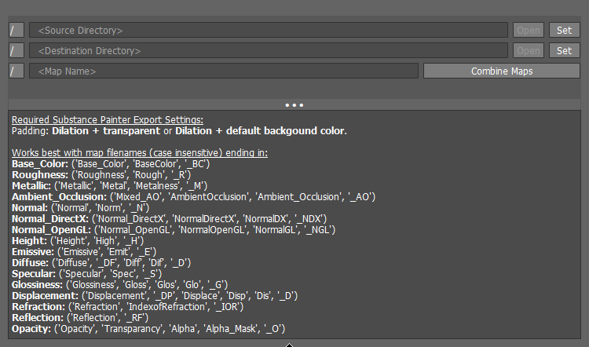

### Map Compositor

Ships as part of the [extapps](../README.md) collection. Engine logic
lives in :class:`pythontk.MapCompositor`; this page documents the UI panel
and end-user workflow.

Map Compositor allows you to seamlessly combine multiple texture maps of a particular type (such as Base Color, Normal Map, etc.) into single, unified images.

Able to convert between different Normal Map formats during the compositing process (DirectX to OpenGL and vice versa).

---
<!-- short_description_start -->
*A UV texture map compositor*
<!-- short_description_end -->

